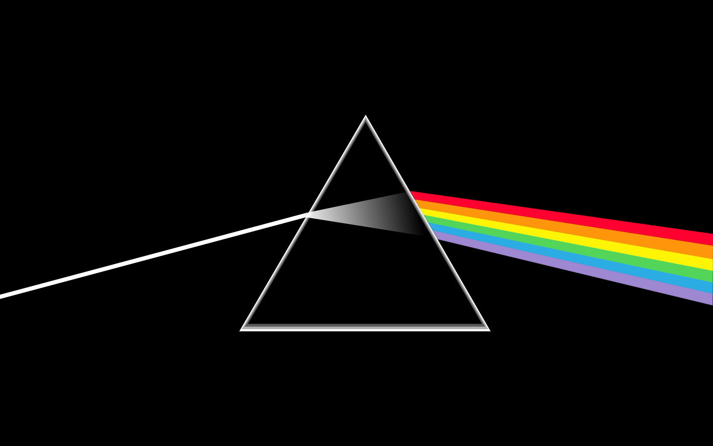

# ADTs and Optics
## A Practical Guide to 
## Referential Transperancy


___

## ADTs and Optics: Review

Review: mutation is a *side effect* and makes us feel uneasy about our code, so our *goal* is to:

*construct a domain model that is that is 100% referentially transparent with immutable data structures*.

___

## ADTs and Optics: How? 

* ADTs for the immutable data structures
* Optics to get/set values

___

## What is an ADT?

An *algebraic data type* is a composite type formed by combining other types

We'll be discussing *product type* and *sum type*

___

## ADTs: Product Type

*Scala*

```scala
case class Point(x: Int, y: Int)
case class Circle(radius: Double, point: Point)
```

___

## ADTs: Product Type

*TypeScript*

```typescript
interface Point {
  readonly _tag: "Point"
  readonly x: number
  readonly y: number
}

const point = (x: number) => (y: number): Point => 
  ({ _tag: "Point", x, y })

```
___

## ADTs: Product Type

*TypeScript*

```typescript

class Circle{
  readonly _tag: "Circle" = "Circle"
  readonly radius: number
  readonly point: Point
  constructor(_radius: number, _point: Point){
    this.radius = _radius
    this.point = _point
  }
}

const circle = new Circle(radius, point)
// vs. 
const point = { _tag: "Point", x: 10, y: 20 }


```

___

## ADTs and Optics: Problems

Pattern matching sucks 

*TypeScript*

```typescript
export enum SHAPE { CIRCLE, OVAL, SQUARE } 

export const hasEdges = (shape: SHAPE): boolean => {
  switch(shape){
    case SHAPE.CIRCLE: return false 
  }
  return true;
}

console.log(hasEdges(SHAPE.OVAL))
```
___

## ADTs and Optics: Problems

Pattern matching sucks 

*Scala* 

```scala
trait UserLike{
  val first: String
  val last: String
}

case class User(first: String, middle: String, last: String) extends UserLike
case class Employee(id: String, first: String, last: String) extends UserLike

def fullName(userLike: UserLike): String = userLike match {
  case User(first, middle, last) => s"$first $middle $last"
}

fullName(Employee("12345", "Dustin", "Whitney"))

```

___

## ADTs and Optics: Problems

Modifying data sucks

*TypeScript*

```typescript
const employee: Employee = {name:"john",company:{name:"awesome inc",address:{city:"london",street:{num:23,name:"high street"}}}}

const employee2 = {
  ...employee,
  company: {
    ...employee.company,
    address: {
      ...employee.company.address,
      street: {
        ...employee.company.address.street,
        name: capitalize(employee.company.address.street.name)
      }
    }
  }
}
```

___
## ADTs and Optics: Problems

Modifying data sucks

*Scala*

```scala
val employee = Employee("john", Company("awesome inc", Address("london", Street(23, "high street"))))

val employee2 = employee.copy(
  company = employee.company.copy(
    address = employee.company.address.copy(
      street = employee.company.address.street.copy(
        name = employee.company.address.street.name.capitalize // luckily capitalize exists
      )
    )
  )
)
```

___


## ADTs and Optics: Problems

My program is beautiful but everything else sucks

*TypeScript*

```typescript
type LoginInfo = { username: string, password: string }
type LoginResponse = ... 

const handleLogin = (loginInfo: LoginInfo): LoginResponse => ... 

app.post("/", (req: any, res: any) => {
  res.send(JSON.stringify(handleLogin(req.body)))
});

```

*Command Line*

```
curl -XPOST -d '{"name":"foo","pw":"password"}' http://example.com
```

___


