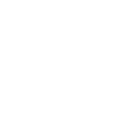
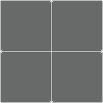
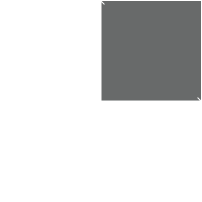

# Referential Transparency and Equational Reasoning

---

## Referential Transparency

An expression is called *referentially transparent* if it can be replaced with its corresponding value without changing the program's behavior. This requires that the expression is *pure*, that is to say the expression value must be the same for the same inputs and its evaluation must have no *side effects*.

###tl;dr 
*referentially transparent* functions are *pure* and have no *side effects*

---

## Pure Functions 
*Math*

```
y(m, x, b) = m * x + b
five = y(1, 2, 3)
```
*Scala*

```scala
def y(m : Int, x : Int, b : Int): Int = m * x + b
val five = y(1, 2, 3)
```

*JavaScript*

```javascript
const y = (m: number, x: number, b: number): number => m * x + b;
const five = y(1, 2, 3);
```
---

## Pure Functions: Substitution
*Math*

[.code-highlight: 2]
```
y(m, x, b) = m * x + b
five = 5

```
*Scala*

[.code-highlight: 2]
```scala
def y(m : Int, x : Int, b : Int): Int = m * x + b
val five = 5
```

*JavaScript*

[.code-highlight: 2]
```javascript
const y = (m: number, x: number, b: number): number => m * x + b
const five = 5
```

---

## More Pure Functions: Substitution?

*JavaScript*

```javascript
import { List } from "immutable"

const sum = (nums: List<number>): number => {
  let total = 0;
  for(let num of nums){
    total += num;
  }
  return total;
}
```

---
## More Pure Functions: Substitution?

*Scala*

```scala
def sum(nums: List[Int]): Int = {
  var i, total = 0
  while(i < nums.size){
    total = total + nums(i)
    i = i + 1
  }
  return total;
}
```
___

## Impure Functions: Mutation

*Scala*

```scala
var count: Int = 0
def increment(): Unit = count = count + 1
def getCount(): Int = count

val zero = getCount()
increment()
zero == getCount() //false
```

*JavaScript*

```javascript
let count: number = 0
const increment = (): void  => { count++ }
const getCount = (): number => count

const zero: number = getCount()
increment()
zero === getCount() //false
```

---

## Impure Functions: Reading values outside the program

*Scala*

```scala
def isTodayOdd(): Boolean = 
  new java.util.Date().getDay() % 2 == 1
```

*JavaScript*

```javascript
const isTodayDayOdd = (): boolean => 
  (new Date().getDay() + 1) % 2 === 0

```

---

## More Impure Functions: IO

*Scala*

```scala
def getText(fileName: String): String = 
  scala.io.Source.fromFile(fileName).getLines.mkString
```

*JavaScript*

```javascript
const getText = (fileName: string): string => 
  fs.readFileSync(fileName).toString()
```

---

## What makes a function impure?
Side effecting functions:

* Perform I/O (disk, network, console)
* Get values from *outside of the program* (dates, random numbers)
* Mutating values beyond its scope

Functions without these things make us feel safe!

--- 

## Side Effects

All I do all day is make side-effects! How do I get anything done if I can't do that!

---

### Side Effects: Pure Functions

```
y = m * x + b
```

---

### Side Effects: Side Effects

[.code-highlight: 2]
```
y = m * x + b
y = (e * m) * (e * x) + (e * b)
```

---

### Side Effects: Factor out Side Effects

[.code-highlight: 3]
```
y = m * x + b
y = (e * m) * (e * x) + (e * b)
y = e(m * x + b)
```

---

### Side Effects: Bind More Side Effects

[.code-highlight: 4]
```
y = m * x + b
y = (e * m) * (e * x) + (e * b)
y = e(m * x + b)
y = e(m * x + b) + e(5)
```
---

### Side Effects: Bind More Side Effects

[.code-highlight: 5]
```
y = m * x + b
y = (e * m) * (e * x) + (e * b)
y = e(m * x + b)
y = e(m * x + b) + e(5)
y = e(m * x + b + 5)
```
---

### Side Effects: Map in Pure Functions

[.code-highlight: 6]
```
y = m * x + b
y = (e * m) * (e * x) + (e * b)
y = e(m * x + b)
y = e(m * x + b) + e(5)
y = e(m * x + b + 5)
y = e(m * x + b + 5) + 10
```
---

### Side Effects: Map in Pure Functions

[.code-highlight: 7]
```
y = m * x + b
y = (e * m) * (e * x) + (e * b)
y = e(m * x + b)
y = e(m * x + b) + e(5)
y = e(m * x + b + 5)
y = e(m * x + b + 5) + 10
y = e(m * x + b + 5 + 10)
```
---

### Side Effects: Essence of FP 

```
y = m * x + b
y = (e * m) * (e * x) + (e * b)
y = e(m * x + b)
y = e(m * x + b) + e(5)
y = e(m * x + b + 5)
y = e(m * x + b + 5) + 10
y = e(m * x + b + 5 + 10)
```
#### FP is Essentially
* binding side effecting contexts together (*flatMap*)
* mapping pure functions into side effecting contexts (*map*)

---

## What does this look like in practice?

DEMO TIME

___

## Equational Reasoning

*Equational reasoning* is the notion that we can understand what to expect from a function simply by looking at a function's types and their associated properties. 

---
## Equational Reasoning: Intuition 

$$
\begin{equation*}
\begin{aligned}
& y(m,x, b) 
& = m * x + b \\
& \text{where}
& m,x,b,y \in ℝ
\end{aligned}
\end{equation*}
$$



___

## Equational Reasoning: Intuition 
$$
\begin{equation*}
\begin{aligned}
& y(m,x,b) 
& = m * x + b \\
& \text{where}
& m,x,b,y \in ℝ
\end{aligned}
\end{equation*}
$$



___

## Equational Reasoning: Intuition 
$$
\begin{equation*}
\begin{aligned}
& y(m,x,b) 
& = m * x + b \\
& \text{where}
& m,x,b,y \in ℕ 
\end{aligned}
\end{equation*}
$$


___

## Equational Reasoning: Intuition 
$$
\begin{equation*}
\begin{aligned}
& y(m,x,b) 
& = m * x + b \\
& \text{where}
& m,x,b,y \in ℕ 
\end{aligned}
\end{equation*}
$$



___

## Equational Reasoning: Intuition 

$$
\begin{equation*}
\begin{aligned}
& y(m,x,b) 
& = \ldots \\
& \text{where}
& m,x,b,y \in ℕ 
\end{aligned}
\end{equation*}
$$


___

## Equational Reasoning: Intuition 

$$
\begin{equation*}
\begin{aligned}
& y(m,x,b) 
& = \ldots \\
& \text{where}
& m,x,b,y \in ℕ  \\
\\
& r(n)
& = \ldots \\
& & n \in ℕ \\
& & r \in ℝ \\
\\
& n(r)
& = \ldots \\
& & n \in ℕ \\
& & r \in ℝ
\end{aligned}
\end{equation*}
$$


___

## Equational Reasoning: Intuition 

$$
\begin{equation*}
\begin{aligned}
& y(m,x,b) 
& = \ldots \\
& \text{where}
& m,x,b,y \in ℕ  \\
\\
& r(n)
& = \ldots \\
& & n \in ℕ \\
& & r \in ℝ \\
\\
& n(r)
& = \ldots \\
& & n \in ℕ \\
& & r \in ℝ
\end{aligned}
\end{equation*}
$$


___

## Equational Reasoning: Practice 

*Scala* 

```scala
def addNaturalNumbers(a: Int, b: Int): Either[Throwable,Int] = ???
```

*JavaScript*

```javascript
const addNaturalNumbers = (a: number, b: number): Either<Error,number> => ...
```

___

## Equational Reasoning: Practice 

*Scala* 

```scala
case class NaturalNumber private (n: Int)
object NaturalNumber{
  def create(n: Int): Either[Throwable, NaturalNumber] = ???
}

def addNaturalNumbers(a: NaturalNumber, b: NaturalNumber): NaturalNumber = ???
```

*JavaScript*

```javascript
opaque type NaturalNumber = number 
const createNaturalNumber = (n: number): Either<Error, NaturalNumber> => 

const addNaturalNumbers = (a: NaturalNumber, b: NaturalNumber): NaturalNumber => 
```
___

## Equational Reasoning: Practice 

*Scala* 

```scala
 def createUser(username: String, email: String): Either[Throwable, User]

 def createUser(username: Username, email: Email): User
```

*JavaScript*

```javascript
const createUser = (username: string, email: string): Either<Throwable,User> => ... 

const createUser = (username: Username, email: Email): User => ... 
```

___

## Equational Reasoning: Theory 

Imagine each function below must be pure. How many possible implementations can each function have?

*Scala*

```scala
def foo[A](a: A): A = ??? 
```
*JavaScript*

```javascript
const foo = <A>(a: A): A => ??? 
```

___

## Equational Reasoning: Theory 

Imagine each function below must be pure. How many possible implementations can each function have?

*Scala*

```scala
def foo[A](a: A, a2: A): A = ??? 
```
*JavaScript*

```javascript
const foo = <A>(a: A, a2: A): A => ??? 
```

___

## Equational Reasoning: Theory 

Imagine each function below must be pure. How many possible implementations can each function have?

*Scala*

```scala
def foo(a: Int): Int = ??? 
```
*JavaScript*

```javascript
const foo = (a: number): number => ...
```

___


## Equational Reasoning: Theory 

Forget purity for a moment...

*Scala*

```scala
def foo(a: Int): Unit = ??? 
```
*JavaScript*

```javascript
const foo = (a: number): Void => ...
```

___


## Equational Reasoning: Composition

*Scala*


```scala
def makePoints(xs: List[Int]): List[Points] = ...
def plot(points: List[Points]): Chart = ...
def toSVG(chart: Chart): Chart = ...
def render(xs: List[Int]): Chart = toSVG(plot(makePoints(xs)))
```

*JavaScript*

```javascript
const makePoints = (xs: List<number>): Points => 
const plot = (points: Points): Chart => 
const toSVG = (chart: Chart): SVG => 
const render = (xs: List<number>): SVG => toSVG(plot(makePoints(xs)))

```
___

## Equational Reasoning: Composition with Side Effects

*Scala*


```scala
def makePoints(xs: List[Int]): IO[List[Points]] = ???
def plot(points: List[Points]): IO[Chart] = ???
def toSVG(chart: Chart): IO[SVG] = ???
def render(xs: List[Int]): IO[SVG] = for {
  points  <- makePoints(xs)
  chart   <- plot(points)
  svg     <- toSVG(chart) 
} yield svg 

def render2(xs: List[Int]): IO[SVG] = 
  makePoints(xs)
    .flatMap(plot)
    .flatMap(toSVG)
```
___

## Equational Reasoning: Composition with Side Effects

*JavaScript*

```javascript
const makePoints = (xs: List<number>): IO<Points> => 
const plot = (points: Points): IO<Chart> => 
const toSVG = (chart: Chart): IO<SVG> => 
const render = (xs: List<number>): IO<SVG> => 
  makePoints(xs)
    .chain(plot)
    .chain(toSVG)

```
___


## Equational Reasoning: Theory 

Adding properties...

*Scala*

```scala
def foo[A](a: A, a2: A, combiner: (A,A) => A): A = ???
foo(1, 2, (a, b) => a + b)
```
*JavaScript*

```javascript
foo("a","b", ((a,b) => a + b))
```

___

## Equational Reasoning: Practice

You can work these concepts into your day by not using curly braces.

*Scala*

```scala
def render(xs: List[Int]): IO[SVG] = 
  makePoints(xs)
    .flatMap(plot)
    .flatMap(toSVG)
```

*JavaScript*

```javascript
const render = (xs: List<number>): IO<SVG> => 
  makePoints(xs)
    .chain(plot)
    .chain(toSVG)
```

___

## Summary

* *Referentially transparent* functions are *pure* and have no *side effects*
* *pure* functions make us feel "safe" because they are predictable and do not mutate external state
* *pure* functions are easy to reason about because they have clear boundaries (domain/range)
* *pure* functions *compose*, which allows you to build large programs (functions) by combining small components (functions)
* functional programming seeks to "factor out" side effects from pure code, so that you can make referentially transparent functions

___

## Exercises: find the last element of a list
*for now assume the list isn't empty*

Example:

scala> last(List(1, 1, 2, 3, 5, 8))
res0: Int = 8*

___

## Exercises: find the last element of a list
*for now assume the list isn't empty*

Example:

scala> penultimate(List(1, 1, 2, 3, 5, 8))
res0: Int = 5
___

## Exercises: Reverse a list.
*for now assume the list isn't empty*

Example:

scala> reverse(List(1, 1, 2, 3, 5, 8))
res0: List[Int] = List(8, 5, 3, 2, 1, 1)

___

## Exercises: Flatten a nested list structure.
*for now assume the list isn't empty*

Example:

scala> flatten(List(List(1, 1), 2, List(3, List(5, 8))))
res0: List[Any] = List(1, 1, 2, 3, 5, 8)

___

## Exercises: Eliminate consecutive duplicates of list elements.
*for now assume the list isn't empty*

Example:

scala> compress(List('a, 'a, 'a, 'a, 'b, 'c, 'c, 'a, 'a, 'd, 'e, 'e, 'e, 'e))
res0: List[Symbol] = List('a, 'b, 'c, 'a, 'd, 'e)

___

## Next time?

* Reader monad?
* ADTs and Optics?
* Parametric Polymorphism, Higher Kinded Types, and Type Classes?

