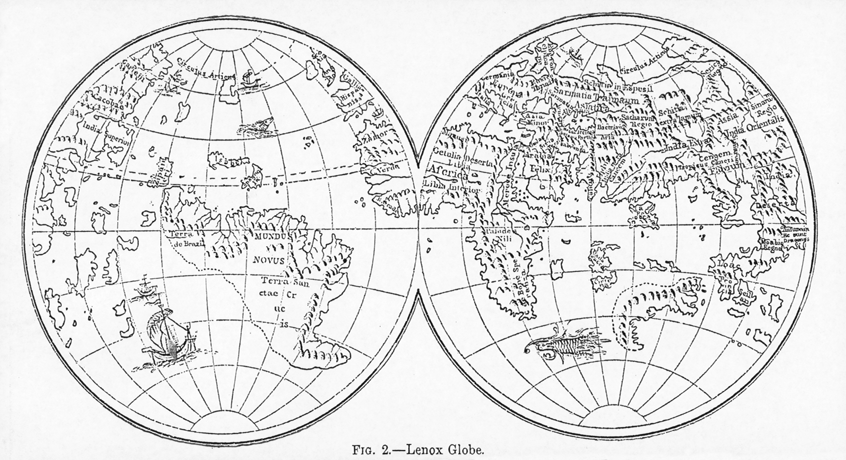

## Feedback from last time

* Less content
* Get examples from code base to relate to our everyday use
* Encourage more engagement
* JavaScript developers are interested!
* Question: what do we lose by not using static types?

___


## Mea culpa

* I bit off more than I can chew with this one
* ADTs today
* Optics next time
* Examples and exercises next time

___


# ADTs and Optics: 
## The bread and butter of a functional domain model


___


## Goals 

* Review where we came from
* Setup problems resulting from where we came from
* Work our way through a solution

___

## Review: Referential Transparency
* Referentially Transparent Functions:
  * pure / substitution principle
  * no side effects

___

## Problem: mutation is a side effect, but makes some problems easy...

*Scala*

```scala
case class Street(var number: Int, var name: String)
case class Address(var city: String, var street: Street)
case class Company(var name: String, var address: Address)
case class Employee(var name: String, var company: Company)

val employee = Employee("john", Company("awesome inc", Address("london", Street(23, "high street"))))
employee.company.address.street.name = employee.company.address.street.name.capitalize
```
___

## Problem: previous example, but without mutation

*Scala*

```scala
employee.copy(
  company = employee.company.copy(
    address = employee.company.address.copy(
      street = employee.company.address.street.copy(
        name = employee.company.address.street.name.capitalize
      )
    )
  )
)
```
___

## Problem: mutation is a side effect, but makes some problems easy...

*TypeScript*

```typescript
interface Street { num: number, name: string }
interface Address { city: string, street: Street }
interface Company { name: string, address: Address }
interface Employee { name: string, company: Company }
const employee: Employee = 
  {name: 'john',company:{name:'awesome inc',address:{city:'london',street:{num: 23,name:'high street'}}}}

const capitalize = (s: string): string => s.substring(0, 1).toUpperCase() + s.substring(1)

employee.company.address.street.name = capitalize(employee.company.address.street.name)


```
___

## Problem: previous example, but without mutation

*TypeScript*

```typescript
export const employee2 = {
  ...employee,
  company: {
    ...employee.company,
    address: {
      ...employee.company.address,
      street: {
        ...employee.company.address.street,
        name: capitalize(employee.company.address.street.name)
      }
    }
  }
}
```
___

## Problem: Summary
  * We need to manipulate immutable data structures with ease

___


## Solution: ADTs and Optics

* *ADTs* to create immutable data structures
* *Optics* to manipulate them

___

## Solution: ADTs

ADTs (*algebraic data types*) are the values that go into our functions: 

$$
\begin{equation*}
 y(m,x,b) = \ldots
\end{equation*}
$$

___

## Solution: ADTs

ADTs are data types we create to represent the entities in our domain model (*User, CommonStock, Portfolio, etc.*), and we will discuss the two most common:
  
  * Product Types
  * Sum Types

___

## Solution: Product Types

Product types are a data structure with *fields*:

* classes
* interfaces
* Tuples
* Records
* Structs

___

## Solution: Product Type Examples

*Scala*

```scala
case class User(
  firstName: String,
  middleName: String,
  lastName: String
)
```

___

## Solution: Product Type Examples

*TypeScript*

```typescript
interface User { 
  readonly firstName: string
  readonly middleName: string
  readonly lastName: string
}

```
___

## Solution: Sum Types

Sum types (*aka: variant, discriminated union, disjoint union, tagged union*) are used to describe a type that can take one of several discreet values.


___


## Solution: Sum Type Examples

*Scala* 

* Option
* Either
* Try 

___

## Solution: Sum Type Examples

*Scala* 

```scala
sealed trait Shape
case class Square(height: Double, width: Double) extends Shape
case class Circle(radius: Double) extends Shape
```

...demo
___

## Solution: Sum Type Examples

*TypeScript*

```typescript
export interface Circle {
  readonly _tag: "Circle"
  readonly radius: number
}

export interface Square {
  readonly _tag: "Square"
  readonly width: number
  readonly height: number
}

export type Shape = Circle | Square
```

...demo

___

## Solution: Here be Dragons

programming in Typescript is a constant struggle with the un-typed



___


## Solution: io-ts

Our friend *@gcanti* offers a solution: [io-ts](https://github.com/gcanti/io-ts)!

___

## Solution: io-ts Example

*Typescript*

```typescript
export const Person = t.type({
  firstName: t.string,
  lastName: t.string,
  age: t.number
});

export interface IPerson extends t.TypeOf<typeof Person>{}

export const either: Either<t.Errors, IPerson> = 
  Person.decode(JSON.parse('{"firstName":"Dustin", "lastName": "Whitney", "age": 39 }')) 

```
___

## Next time: Optics!


___

* defined adts
  * adts are the data types we create to represent the entities in our domain model
  * they are commonly discussed in two different flavors: product types and sum types
  * Product Types
  * Sum Types
* define optics
  * Lens manipulates product types
  * Prism manipulates sum types
* adts how-to
  * product types:
    * scala: case classes for product types
    * typescript: interface with tag attribute 
    * typescript: class with tag attribute
  * sum types: 
    * scala: sealed trait
      * example pattern matching on class without sealed trait
      * example pattern matching on class with sealed trait
    * typescript: union type (tagged/discriminated union)
      * example pattern matching on interface without tag
      * example pattern matching with tag

* optics how-to
  * Libraries for optics
    * scala: monocle
    * typescript: monocle-ts 
  * Lens/Product Types 
    * Getting values is pretty easy in either Scala or TypeScript example without Lens
    * Getting values with Lens
      * Scala example
      * TypeScript example
    * Setting values is painful. 
      * Scala example: setting values without a Lens
      * Scala example: setting values with a Lens
      * TypeScript example: setting values without a Lens
      * TypeScript example: setting values with a Lens

  * Prism/Sum Types
    * Getting values from Sum types is a PITA
      * Scala examples
        * without Prism
        * with Prism
      * TypeScript example
    * Setting values is even more painful then Product types!
      * Scala example (if time permits)
      * TypeScript example (if time permits)
    * Setting values with prisms ain't so bad
      * Scala example
      * TypeScript example

  * Traversals / Folds: discuss they exist


* Examples:
  * scala: Invest trait

* Aside for io-ts

* Additional materials
  * Ed Kmett on optics
  * Phil Freeman on profunctor-optics


